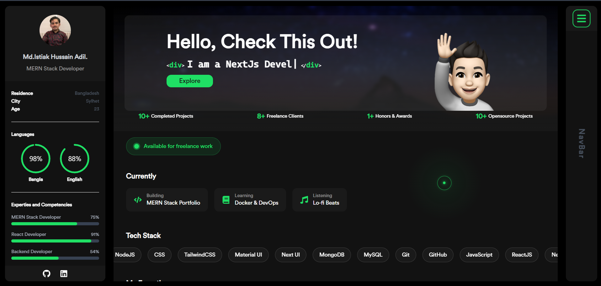

# 🚀 Md. Istiak Hussain Adil — Developer Portfolio

A modern, fully dynamic personal portfolio website built with **Next.js**, **Tailwind CSS**, and **MongoDB**. All content is managed through a separate [Admin Dashboard](https://github.com/IstiakAdil14/porfolio-admin) — no code changes needed to update anything.



---

## ✨ Features

### Pages
- **Home** — Hero banner, availability badge, currently doing, tech stack marquee, expertise cards, how I work, what I do & don't, open source repos, GitHub activity heatmap, fun stats, interactive terminal
- **Portfolio** — Project showcase cards with tech stack, live links
- **Background** — Education & experience timeline
- **Contact** — Dynamic contact info, social links, working contact form

### Highlights
- 🎯 **Fully Dynamic** — Every piece of content is stored in MongoDB and editable from the admin dashboard
- 🖱️ **Custom Animated Cursor** — Green dot + ring + spotlight glow effect
- 💻 **Interactive Terminal** — Visitors can type `whoami`, `skills`, `contact`, `social`
- 📊 **GitHub Integration** — Live repos and contribution heatmap pulled from GitHub API
- 📧 **Working Contact Form** — Sends real emails via Nodemailer + Gmail
- 🎨 **Smooth Animations** — Framer Motion scroll animations throughout
- 📱 **Fully Responsive** — Mobile, tablet, and desktop

---

## 🛠️ Tech Stack

| Category | Technology |
|---|---|
| Framework | Next.js 13 |
| Styling | Tailwind CSS, Custom CSS |
| Database | MongoDB Atlas + Mongoose |
| Animations | Framer Motion |
| Email | Nodemailer |
| UI Components | Ant Design |
| Data Fetching | React Query + Axios |
| Icons | React Icons |
| Fonts | EPIC PRO |

---

## 📁 Project Structure

```
portfolio/
├── components/
│   ├── Common/
│   │   ├── Intro/          # Sidebar: skills, tools, location, contact
│   │   └── Nav/            # Navigation drawer
│   ├── HomeComponents/     # All home page sections
│   ├── Background/         # Education & experience cards
│   └── Portfolio/          # Project cards
├── pages/
│   ├── api/                # API routes (all read from MongoDB)
│   │   ├── expertise.js
│   │   ├── portfolio.js
│   │   ├── background.js
│   │   ├── skills.js
│   │   ├── profile.js
│   │   ├── meta.js
│   │   └── send-email.js
│   ├── index.jsx           # Home page
│   ├── portfolio.jsx        # Portfolio page
│   ├── background.jsx       # Background page
│   └── contact.jsx          # Contact page
├── lib/
│   └── mongodb.js          # DB connection + Mongoose models
├── public/
│   ├── fonts/              # Circular font family
│   └── images/             # Static assets
└── constants/
    └── constants.js        # Fallback static data
```

---

## 🚀 Getting Started

### Prerequisites
- Node.js 18+
- MongoDB Atlas account (free tier works)
- Gmail account with App Password enabled

### 1. Clone the repository

```bash
git clone https://github.com/IstiakAdil14/portfolioWithNextJS.git
cd portfolioWithNextJS/portfolio
```

### 2. Install dependencies

```bash
npm install
```

### 3. Set up environment variables

Create a `.env.local` file in the root:

```env
MONGODB_URI=mongodb+srv://<username>:<password>@cluster0.xxxxx.mongodb.net/portfolio
GMAIL_USER=your_gmail@gmail.com
GMAIL_APP_PASSWORD=your_gmail_app_password
```

> **Gmail App Password:** Go to Google Account → Security → 2-Step Verification → App Passwords

### 4. Seed the database

The portfolio reads all content from MongoDB. Use the admin dashboard's seed script to populate initial data:

```bash
cd ../portfolio-admin
node seed.mjs
```

### 5. Run the development server

```bash
cd ../portfolio
npm run dev
```

Open [http://localhost:3000](http://localhost:3000)

---

## 🔗 Admin Dashboard

All content is managed through the companion admin dashboard:

👉 **[portfolio-admin](https://github.com/IstiakAdil14/porfolio-admin)**

The dashboard controls:
- Profile info (name, bio, photo, social links, resume URL)
- Expertise cards
- Projects
- Education & Experience
- Skills & Tech Stack
- Currently Doing widget
- Fun Stats counters
- Availability badge

---

## 📡 API Routes

| Endpoint | Description |
|---|---|
| `GET /api/expertise` | Expertise cards |
| `GET /api/portfolio` | Projects |
| `GET /api/background` | Education & experience |
| `GET /api/skills` | Skill bars |
| `GET /api/profile` | Profile info |
| `GET /api/meta?key=` | Dynamic meta (techStack, currently, funstats, availability) |
| `POST /api/send-email` | Contact form email |

---

## 🌐 Deployment

### Vercel (Recommended)

1. Push to GitHub
2. Import project on [vercel.com](https://vercel.com)
3. Add environment variables in Vercel dashboard
4. Deploy ✅

---

## 📬 Contact

**Md. Istiak Hussain Adil**

- 📧 Email: [istiakadil346@gmail.com](mailto:istiakadil346@gmail.com)
- 💼 LinkedIn: [istiak-adil](https://www.linkedin.com/in/istiak-adil-755361329/)
- 🐙 GitHub: [IstiakAdil14](https://github.com/IstiakAdil14)
- 🐦 Twitter: [@istiakadil](https://x.com/istiakadil)

---

## 📄 License

This project is open source and available under the [MIT License](LICENSE).

---

<p align="center">Made with ❤️ by <a href="https://github.com/IstiakAdil14">Adil</a></p>
